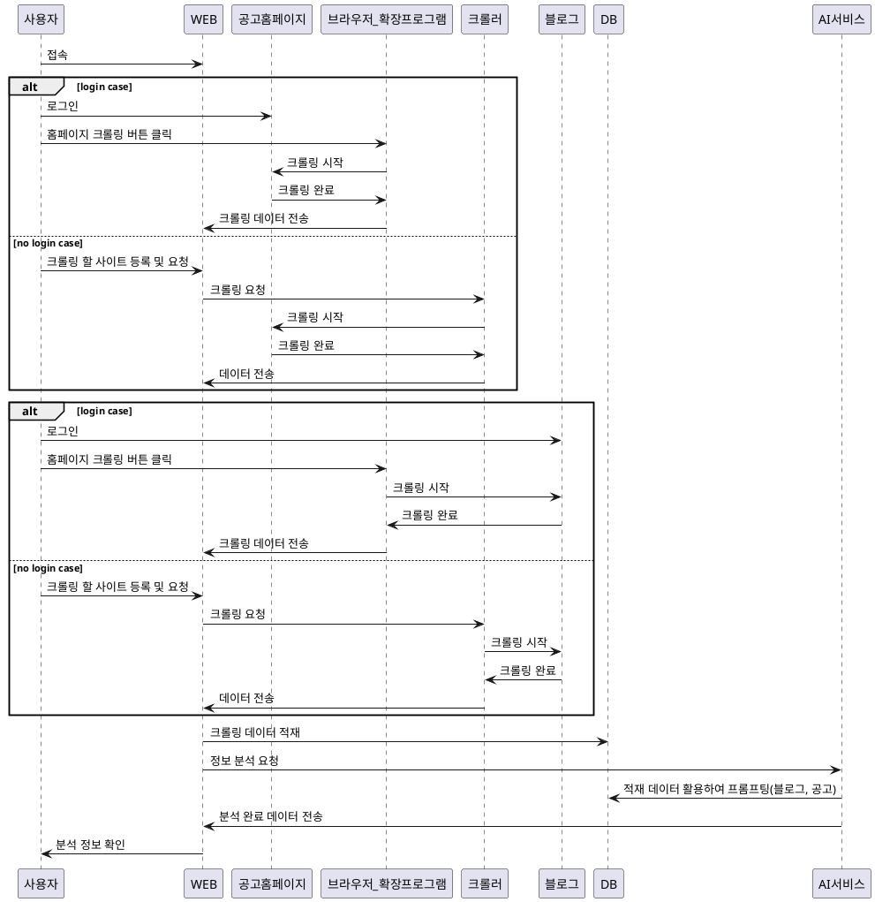

# 부업 어플리케이션 ADR 문서

작성자 : 최현호  

----

## 개요

본 문서는 젝트 프로젝트 아키텍쳐 관해 결정사항을 공유하고자 작성된 문서입니다.  
  
## Context

젝트 프로젝트는 AI를 활용하여 어플리케이션을 개발하기로 협의가 되었으며, 이에 따른 아키텍쳐 방향성은 다음 두 가지가 있습니다.  
1. 데이터 크롤링부터 모든 전 과정을 AI로 진행
2. 크롤링 모듈을 따로 개발하고 데이터 해석 부분만 AI에게 위임
  
각 결정사항에 대한 장단점은 다음과 같습니다.  

| No | 장점 | 단점 |
|---|---|---|
|1|  개발난이도가 쉬움 | AI 비용이 굉장히 많이 들어가며, 응답 대기시간이 긺(최적화가 어려움), 답변에 할루시네이션 확률이 높음 |
|2 | 데이터 크롤링을 통해서 데이터의 신뢰도를 올려주며, 핵심적인 부분을 캐싱하여 AI에게 넘겨질 데이터가 고정적임. AI 비용 절감 및 최적화 가능 | 크롤링 개발 난이도가 높은편 |

두 가지 안건에 공통적으로 구현이 어려운 부분은 다음과 같습니다.  

1. 크롤링을 법적, 구조적으로 막고 있는 서비스의 경우 크롤링이 불가능
2. 로그인이 필요한 서비스의 경우 크롤링이 어려움

위 두가지 리스크에 대해서는 다음과 같은 대안을 제안합니다.  

1. 로그인 필요 서비스의 경우 : 크롬 확장 프로그램 등을 제공하여, 크롤링이 되는 페이지 인 경우 확장 프로그램이 크롤링을 할 수 있도록 개발
2. 크롤링 불가 서비스 : 사용자가 직접 공고를 붙여 넣어서 비교 할 수 있도록 서비스 제공 필요

이에 등록가능한 공고 사이트 및 블로그에 대한 제한이 필요할 것으로 보입니다.(유효성 포함)  

## Decision

Context를 고려하여 가장 안정적인 아키텍쳐 및 논리 흐름은 다음과 같습니다.



- 플로우를 기반으로 서비스 아키텍쳐는 다음과 같이 구성될 수 있습니다.
```plantuml
package "private" {
   database DB {
      [DBData]
   }
   [API]
   [AI]
}

package "public" {
    [crawler]
    [Front]
    [Gateway]
}

User --> [Gateway]
[Gateway] --> [API]
[Gateway] --> [crawler]
[Gateway] --> [Front]
[crawler] --> [API]
[Front] --> [crawler]
[API] --> [Front]
[API] --> [DBData]
[AI] --> [DBData]
[AI] --> LLM
LLM --> [AI]
[API] --> [AI]
[AI] --> [API]

```

(위 이미지는 아키텍쳐 그림으로 추후 대체될 예정입니다.)

### 확인 필요 사항

1. 블로그 및 사이트 크롤링 법적 이슈
2. 로그인 여부

## Status

기획 단계에서 제안드린 내용에 대한 검토가 필요합니다.  
검토 후 대안 사항 및 기능 변경과 관련하여 면밀히 논의할 필요가 있습니다.  

## Consequences

현재 결정 진행 중이므로 결과 내용은 생략합니다.
